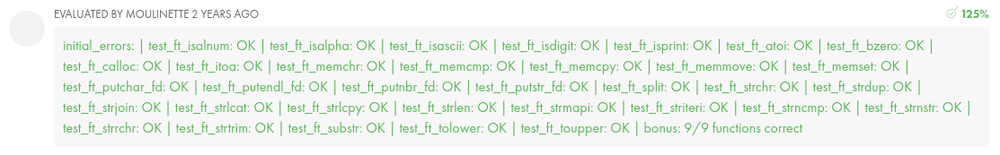

# Libft-42

## Description

Libft is a personal C library that I developed as part of my common core at 42. This project aims to recreate some usual functions from the standard C library. I will use this as a base library for several project in the common core.


 
## Features

Libft includes the following functions:

- String manipulation functions:
  - `ft_strlen`
  - `ft_strcpy`
  - `ft_strncpy`
  - `ft_strcat`
  - `ft_strncmp`
  - `ft_strdup`
  
- Memory management functions:
  - `ft_memset`
  - `ft_bzero`
  - `ft_memcpy`
  - `ft_memmove`
  - `ft_memchr`
  - `ft_memcmp`
  - `ft_calloc`
  
- Conversion functions:
  - `ft_atoi`
  - `ft_itoa`
  
- List management functions:
  - `ft_lstnew`
  - `ft_lstadd_front`
  - `ft_lstadd_back`
  - `ft_lstdelone`
  - `ft_lstclear`
  - `ft_lstiter`
  - `ft_lstmap`

## Installation

To use Libft, simply clone the repository and compile it:

```bash
git clone https://github.com/painpats/Libft-42.git
cd libft
make
